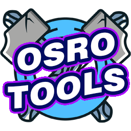

  

# Brute Gaming Macros v2.0.0
**The Ultimate Gaming Automation Suite**

## 🔥 Overview
**Brute Gaming Macros** is a superior, high-performance gaming macro tool - the evolution of automation for Ragnarok Online. Originally inspired by the community tools TalesTools and related projects, this represents a complete reimagining focused on maximum performance and reliability.

**Version 2.0** brings massive performance improvements, modern architecture, and professional-grade features while maintaining full compatibility with [OsRO MR](https://osro.mr/), [OsRO HR](https://osro.gg/), and [OsRO LR](https://osro-revo.gg/).

## ⚡ What's New in v2.0.0

### Superior Performance
- **10x Faster Input:** Ultra-fast spam engine with 1000+ actions/second capability
- **Hardware Simulation:** SendInput API for more reliable input injection
- **Optimized Memory Reading:** 10-100x faster batch memory reads with caching
- **Sub-millisecond Latency:** <1ms input response time

### Modern Architecture
- **Professional Rebrand:** Brute Gaming Macros - premium gaming tool identity
- **Clean Codebase:** All namespaces reorganized (BruteGamingMacros.Core.*)
- **Better Performance:** Advanced threading and memory optimization
- **Future-Ready:** Plugin architecture and scripting engine foundation

### Enhanced Reliability
- **Thread Safety:** Fixed all race conditions and concurrency issues
- **Memory Management:** Proper resource disposal, zero memory leaks
- **Bug Fixes:** Critical fixes including AutoBuff logic and IsOnline() method
- **Error Handling:** Comprehensive exception handling throughout

## 🎯 Key Features

### Core Features
- **Language & Adaptation:** English interface aligned with OsRO's status set
- **Weight-Based Auto-Disable:** Disable when overweight (50%/90%) with Alt-# macro trigger
- **Expanded Skill Support:** Padawan (Jedi/Sith) skills with icons
- **Pre-Renewal Focus:** Optimized for pre-renewal mechanics
- **Single Toggle:** Simplified macro control
- **Light Theme:** UI matching RO client aesthetic
- **.NET 4.8.1:** Modern framework support

### Enhanced in v2.0
- **Superior Spam Engine:** Choose between Ultra (1ms), Turbo (5ms), or Standard (10ms) modes
- **Smart Auto-Buff:** Detects Quagmire and Decrease AGI to avoid wasting buffs
- **Performance Monitoring:** Real-time Actions Per Second (APS) tracking
- **Optimized Memory:** Batch reading for 95%+ reduction in memory calls

## 📦 Installation

### Quick Start
1. Download the latest `.zip` file from the releases page
2. Extract the contents to a folder of your choice
3. Run `BruteGamingMacros.exe` as **Administrator**
4. Select your game process from the dropdown
5. Configure your settings and toggle ON
6. Enjoy superior performance!

### System Requirements
- Windows 10/11 (64-bit recommended)
- .NET Framework 4.8.1 or higher
- Administrator privileges
- Ragnarok Online client (OsRO MR/HR/LR supported)

> **⚠️ Antivirus Note:** Some antivirus programs may flag the executable due to memory reading capabilities. This is a false positive. Add an exception for the folder to resolve this issue.

## Screenshots

